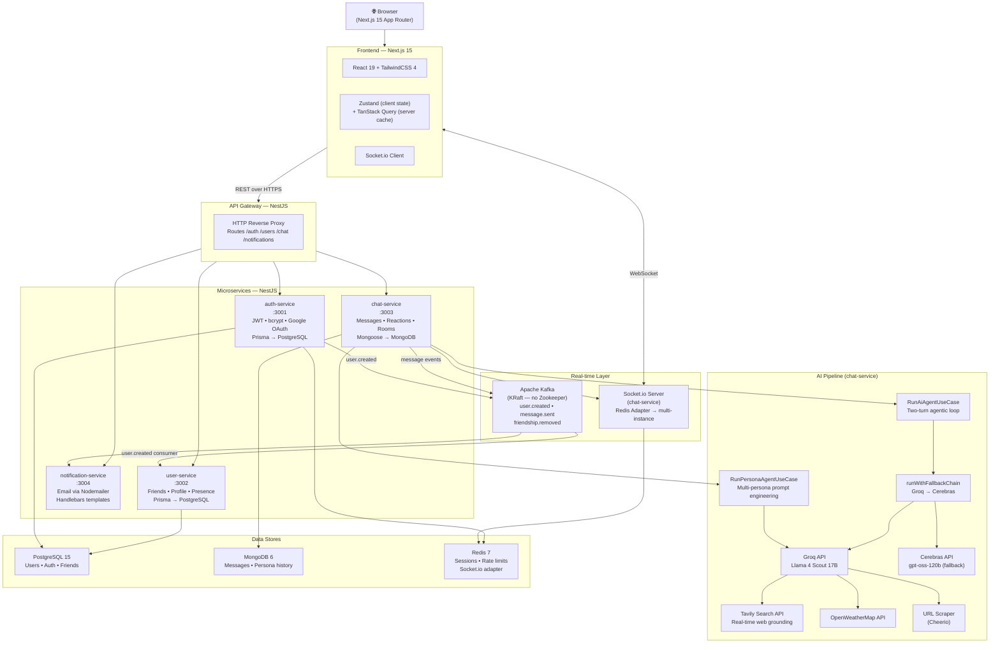

# ChatApp — Production-Grade AI-Powered Chat Platform

<div align="center">


A fully-featured, real-time 1:1 chat application built with a **microservices architecture** and an integrated **AI layer** — including a two-turn agentic loop, multi-persona system prompt engineering, and real-time grounding via the Tavily Search API.

</div>

---

## Table of Contents

- [Overview](#overview)
- [AI Features](#ai-features)
- [System Architecture](#system-architecture)
- [Full Feature List](#full-feature-list)
- [Tech Stack](#tech-stack)
- [Project Structure](#project-structure)
- [Getting Started](#getting-started)
- [Testing](#testing)

---

## Overview

ChatApp is a **production-grade** messaging platform that goes beyond basic chat. It is built as an **NX monorepo** containing five independent NestJS microservices, a Next.js 15 App Router frontend, and a shared type library — all wired together via an API gateway, Apache Kafka (KRaft mode), Socket.io with a Redis adapter, and a multi-model AI pipeline.

The AI subsystem is the centrepiece: users interact with a real-time **@AI agent** that executes a two-turn agentic loop with native tool calling, while a separate `/explore` page hosts five distinct AI personas, each engineered with bespoke system prompts and scoped capabilities.

---

## AI Features

> This section uses precise ML-engineering terminology. Each bullet describes a distinct, independently implemented system.

### 1. @AI In-Chat Agent — Two-Turn Agentic Loop with Tool Calling

Triggered by typing `@AI <query>` in any conversation. The agent executes a structured **two-turn agentic loop** on `meta-llama/llama-4-scout-17b-16e-instruct` via the Groq inference API:

- **Turn 1 (tool selection):** The LLM receives the user query alongside a scoped system prompt and four registered OpenAI-compatible tool schemas. It returns either a `tool_calls` response selecting the appropriate tool, or a direct text answer. The model is constrained by the system prompt to prevent scope creep, jailbreaks, and prompt injection.
- **Tool execution:** The selected tool is dispatched to a dedicated NestJS service:
  - `web_search` → **Tavily Search API** (real-time grounding, live web results)
  - `get_weather` → OpenWeatherMap API (current conditions by city)
  - `summarize_url` → Cheerio-based HTML scraper + Groq summarizer
  - `translate` → Groq single-turn completion (source language auto-detected)
- **Turn 2 (synthesis):** The raw tool result is fed back to the LLM under a separate synthesis system prompt. The model converts the structured data into a natural-language reply in the user's conversational context, under 200 words.
- **Fallback chain:** If Groq is unavailable or rate-limited, an `AgentFallbackService` automatically retries on **Cerebras** (`gpt-oss-120b`) using a shared `runWithFallbackChain` utility.
- **Input guardrails:** A keyword-pattern validator runs before the rate-limit check, blocking prompt injection attempts, credential extraction, and code-generation requests — returning inline user-facing rejection messages rather than silently dropping the query.
- **Shared conversation model:** Both the user's query and the AI reply are persisted as messages and broadcast via Socket.io, so all participants see the full interaction in real time (Telegram/Slack bot model).

---

### 2. AI Expert Personas — Multi-Persona System Prompt Engineering

A dedicated `/explore` page hosts five AI personalities, each a distinct **system prompt engineering** project with scoped capabilities, tailored disclaimers, and independent conversation memory.

| Persona | Role | Web Search | Model |
|---------|------|------------|-------|
| 🔬 **Nova** | Science & Tech Expert | ✅ Tavily-grounded | Llama 4 Scout |
| 💰 **Atlas** | Finance & Markets Analyst | ✅ Tavily-grounded | Llama 4 Scout |
| ⚖️ **Lex** | Legal Concepts Explainer | ✅ Tavily-grounded | Llama 4 Scout |
| 🎓 **Sage** | Socratic Learning Coach | ❌ Knowledge-only | Llama 4 Scout |
| 🌍 **Pulse** | Neutral World News | ✅ Always searches first | Llama 4 Scout |

**How it works:**

- Each persona runs a **two-turn agentic loop** (when `useWebSearch: true`): Turn 1 decides whether to call `web_search`; if called, Turn 2 synthesizes results **in the persona's engineered voice**, inheriting the persona's system prompt as a synthesis suffix.
- **Session memory:** The last 8 turns of conversation history are prepended to every LLM call as `user`/`assistant` messages, giving the model multi-turn context without a stateful session.
- **Per-persona prompt constraints:** Each system prompt encodes role, tone, word-limit, output format (bullet points vs. prose), source-citation policy, and mandatory disclaimers (e.g., Atlas ends every reply with "this is informational only, not financial advice").
- **Prompt injection defense:** A `validatePersonaQuery` function blocks jailbreak patterns before the rate-limit slot is consumed. Sage is selectively exempt from the code-generation block since discussing programming concepts is within its scope.
- **Independent rate limiter:** Persona queries have their own `PersonaRateLimiterService` (sliding window, per-user) separate from the @AI agent limiter.

---

### 3. Smart Reply Suggestions — Context-Aware Chip Generation

After the other user's last message, three one-tap reply chips are surfaced using a **Groq single-turn completion**. The last several messages are passed as context; the model returns three short, contextually appropriate suggestions. Results are cached in TanStack Query by `lastMessageId` with `staleTime: Infinity` — they never refetch for the same message.

---

### 4. AI Message Rewriter — Tone-Conditioned Paraphrase

A Groq completion rewrites the user's draft into a chosen tone (formal, casual, professional, friendly, concise). The result replaces the composer draft directly via Zustand store, with a **Groq → Cerebras fallback chain** for resilience. No conversation context is sent — only the draft and tone instruction.

---

### 5. Conversation Summarizer — Extractive Bullet-Point Summary

A Groq single-turn completion receives the last N messages and returns a bullet-point summary. Delivered via a modal triggered from the conversation header. Server-side rate-limited (HTTP 429 with a user-facing toast).

---

### 6. AI Provider Fallback Chain — Automatic Multi-Provider Resilience

All four AI features (agent, personas, rewriter, summarizer, smart replies) share a common `runWithFallbackChain` utility. It iterates a prioritized provider list, catches rate-limit errors (`rate_limit_exceeded`, `tokens per day`) and service errors, retries on the next provider, and throws `ServiceUnavailableException` only when all providers are exhausted — transparent to the end user.

---

## System Architecture



### Request Lifecycle — Sending a Message

```
User types → MessageComposer (optimistic UI update)
  → POST /chat/messages (API Gateway)
    → chat-service: SendMessageUseCase (MongoDB persist)
      → Kafka: message.sent event
        → Socket.io: message.new broadcast to conversation room
          → Both clients receive real-time update
        → message.delivered emitted when recipient socket ACKs
        → message.read emitted when recipient opens the conversation
```

### Request Lifecycle — @AI Agent

```
User sends "@AI weather in Tokyo"
  → POST /chat/ai-agent (API Gateway)
    → RunAiAgentUseCase:
      1. Normalize + strip @AI prefix
      2. Pattern-match guardrails (injection, credentials, codeGen)
      3. Rate-limit check (in-memory sliding window)
      4. Save query as visible message → emit message.new (both users see query)
      5. Emit typing.started ("AI is typing...")
      6. Groq Turn 1: LLM selects get_weather tool
      7. Execute: OpenWeatherMap API call
      8. Groq Turn 2: synthesize weather result into natural language
      9. Persist AI reply → emit ai.message.new (both users see response)
      10. Emit typing.stopped
```

---

## Full Feature List

### Auth & Account
- Email/password signup with email verification
- Google OAuth 2.0 (Passport.js strategy)
- JWT access tokens + httpOnly refresh tokens with silent rotation (Axios interceptor)
- Forgot / reset / change password
- Account linking (Google + email/password on same account)

### Friends & Social
- User search with debounced query
- Friend requests (send / accept / decline)
- Friend recommendations (mutual connections)
- Remove friend (real-time conversation access revoked via Socket.io)
- Real-time online/offline presence via Socket.io

### 1:1 Chat
- Infinite scroll message history (MongoDB cursor pagination)
- Optimistic UI updates (TanStack Query)
- Quoted replies with inline preview
- Message edit (with "edited" badge) and soft-delete
- Emoji reactions (add / toggle / remove) with real-time sync
- Full emoji picker
- Conversation search by participant name

### Message Status
- **Sent** → **Delivered** → **Read** (blue double-tick) via Socket.io events
- Auto-read when conversation is active

### Real-time Events (Socket.io)
`message.new` · `message.delivered` · `message.read` · `message.updated` · `message.deleted` · `message.reaction` · `typing.started` · `typing.stopped` · `ai.message.new` · `presence.updated` · `friend.request.received` · `friendship.removed`

### Profile
- Edit name, bio, avatar (Cloudinary storage)
- Change email (sends verification to new address)
- Dark / light mode (persisted to profile + localStorage, no hydration flash)

### AI (see [AI Features](#ai-features) for full technical detail)
- @AI In-Chat Agent (two-turn agentic loop, tool calling, Tavily grounding)
- AI Expert Personas — `/explore` (multi-persona system prompt engineering, session memory)
- Smart Reply Chips (context-aware, cached by message ID)
- Message Rewriter (tone-conditioned paraphrase)
- Conversation Summarizer (bullet-point modal)
- Provider Fallback Chain (Groq → Cerebras, transparent to user)

---

## Tech Stack

### Frontend
| Layer | Technology |
|-------|------------|
| Framework | Next.js 15 (App Router, React Server Components) |
| UI Library | React 19 |
| Styling | TailwindCSS 4 + `tw-animate-css` |
| Server state | TanStack Query v5 (infinite queries, optimistic updates) |
| Client state | Zustand v5 with `persist` middleware |
| Real-time | Socket.io Client v4 |
| i18n | next-intl (all strings translated, locale-aware routing) |
| Icons | Lucide React |
| Toasts | Sonner |
| Build | NX workspace, Vite/Vitest |

### Backend
| Layer | Technology |
|-------|------------|
| Framework | NestJS 11 (modular, DI, Guards, Pipes) |
| API style | REST + OpenAPI (Swagger) |
| Auth | Passport.js (JWT + Google OAuth 2.0), bcrypt |
| Validation | class-validator + class-transformer + Zod |
| ORM (relational) | Prisma 7 → PostgreSQL 15 |
| ODM (document) | Mongoose 9 → MongoDB 6 |
| Caching / sessions | Redis 7 (`ioredis`) |
| Message queue | Apache Kafka 3.7 (KRaft, no Zookeeper) via KafkaJS |
| WebSockets | Socket.io 4 with `@socket.io/redis-adapter` |
| Logging | Pino + `nestjs-pino` (structured JSON) |
| Email | Nodemailer + Handlebars templates |
| File storage | Cloudinary (avatar uploads via Multer) |

### AI Stack
| Component | Technology |
|-----------|------------|
| Primary LLM | Groq — `meta-llama/llama-4-scout-17b-16e-instruct` |
| Fallback LLM | Cerebras — `gpt-oss-120b` |
| Web search / grounding | Tavily Search API |
| Weather | OpenWeatherMap API |
| URL scraping | Cheerio |

### Infrastructure & Tooling
| Component | Technology |
|-----------|------------|
| Monorepo | NX 22 |
| Package manager | pnpm |
| Containerisation | Docker Compose (infra services) |
| Type generation | `openapi-typescript` from OpenAPI spec |
| Testing | Vitest + React Testing Library (frontend), Jest + Supertest (backend) |
| Linting | ESLint 9 + TypeScript-ESLint |
| Formatting | Prettier |

---

## Project Structure

```
chat-system/                        ← NX monorepo root
├── apps/
│   ├── frontend/                   ← Next.js 15 App Router
│   │   ├── app/                    ← Pages (login, chat, explore, profile, friends)
│   │   └── src/
│   │       ├── features/           ← Feature modules (auth, chat, friends, persona, profile)
│   │       │   ├── auth/
│   │       │   ├── chat/
│   │       │   ├── friends/
│   │       │   ├── persona/        ← /explore AI personas
│   │       │   └── profile/
│   │       └── shared/             ← UI components, hooks, utils, stores
│   ├── api-gateway/                ← NestJS HTTP reverse proxy (:3000)
│   ├── auth-service/               ← JWT + OAuth, email verification (:3001)
│   ├── user-service/               ← Friends, profile, presence (:3002)
│   ├── chat-service/               ← Messages, Socket.io, AI pipeline (:3003)
│   └── notification-service/       ← Transactional email (:3004)
├── libs/
│   ├── shared-types/               ← TypeScript types shared across all apps
│   └── shared-utils/               ← Persona configs, HTTP helpers
├── libs/openapi-specs/             ← OpenAPI YAML specs per service
├── docs/specs/                     ← Feature requirement specs (14 features documented)
├── docker-compose.yml              ← PostgreSQL, MongoDB, Redis, Kafka
└── tools/scripts/                  ← OpenAPI type generator
```

---

## Getting Started

### Prerequisites

- Node.js 20+
- pnpm 9+
- Docker & Docker Compose

### 1. Clone and install

```bash
git clone https://github.com/Deepanshu-Raghuwanshi/chat-app.git
cd chat-app
pnpm install
```

### 2. Environment variables

Copy the example files and fill in your keys:

```bash
# Each service has its own .env
cp apps/auth-service/.env.example apps/auth-service/.env
cp apps/user-service/.env.example apps/user-service/.env
cp apps/chat-service/.env.example apps/chat-service/.env
cp apps/api-gateway/.env.example apps/api-gateway/.env
cp apps/frontend/.env.local.example apps/frontend/.env.local
```

Required third-party keys:

| Key | Where to get it |
|-----|----------------|
| `GROQ_API_KEY` | [console.groq.com](https://console.groq.com) |
| `CEREBRAS_API_KEY` | [cloud.cerebras.ai](https://cloud.cerebras.ai) |
| `TAVILY_API_KEY` | [app.tavily.com](https://app.tavily.com) |
| `OPENWEATHER_API_KEY` | [openweathermap.org](https://openweathermap.org/api) |
| `GOOGLE_CLIENT_ID` / `GOOGLE_CLIENT_SECRET` | Google Cloud Console |
| `CLOUDINARY_*` | [cloudinary.com](https://cloudinary.com) |

### 3. Start infrastructure

```bash
pnpm start:infra          # Starts PostgreSQL, MongoDB, Redis, Kafka via Docker
```

### 4. Run database migrations

```bash
pnpm db:setup             # Prisma migrate + generate for auth and user schemas
```

### 5. Start all services

```bash
pnpm start:all            # Starts all 5 NestJS services + Next.js in parallel
```

Or start services individually:

```bash
pnpm start:api-gateway
pnpm start:auth-service
pnpm start:user-service
pnpm start:chat-service
pnpm start:notification-service
pnpm start:frontend
```

The app is available at `http://localhost:4200`.

---

## Testing

```bash
# Run everything: typecheck + lint + format + tests across all apps
pnpm check-all

# Frontend only (Vitest + React Testing Library)
pnpm nx test frontend

# Backend service tests (Jest + Supertest)
pnpm nx test chat-service
pnpm nx test auth-service
pnpm nx test user-service

# Type checking
pnpm nx typecheck frontend
pnpm nx typecheck chat-service
```

**272 frontend tests** across 38 test files covering components, hooks, stores, and service integrations.

---

## Architecture Decisions

| Decision | Rationale |
|----------|-----------|
| **Microservices** | Independent deployability and scaling per domain (auth, users, chat, notifications) |
| **Kafka over direct HTTP** | Decouples producers from consumers; `user.created` event syncs the user-service replica without auth-service knowing the consumer |
| **MongoDB for messages** | Flexible schema for message types, reactions array, AI metadata fields; no schema migrations as the message model evolves |
| **PostgreSQL for users** | Strong consistency for auth tokens, friend relationships, and profile data |
| **Redis adapter for Socket.io** | Horizontal scaling — any chat-service instance can broadcast to any connected client |
| **Two-turn agentic loop** | Separates intent detection (Turn 1) from result synthesis (Turn 2) — the synthesizer prompt can be tuned independently without affecting tool selection |
| **Per-persona system prompts** | Encodes scope, tone, output format, and ethical constraints per AI role — enables fine-grained control without a fine-tuned model |
| **Tavily over SerpAPI/Google** | Structured JSON output optimised for LLM consumption; significantly lower latency than parsing raw HTML search results |
| **Groq → Cerebras fallback** | Both provide free-tier inference on open-weight models; the chain ensures AI features remain available during provider outages |

---

<div align="center">

Built by [Deepanshu Raghuwanshi](https://github.com/Deepanshu-Raghuwanshi)

</div>
